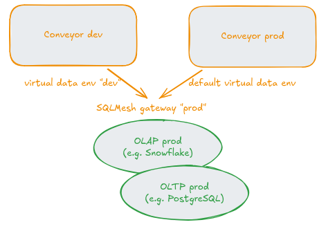
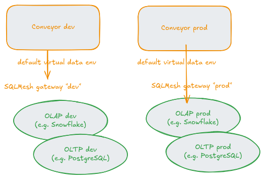

Conveyor and SQLMesh's Write-Audit-Publish pattern
==================================================
 
SQLMesh's _virtual data environments_ are an example of the
_Write-Audit-Publish_ (WAP) pattern: by creating _views_ in non-production
schemas to physical tables managed by SQLMesh, one could audit these relations
prior to publishing them to the production schema.

With Conveyor, usually one has a production environment and one or more
non-production environments. These environments are essentially Kubernetes
namespaces, with a dedicated Airflow service per namespace for scheduling
purposes.

In classical setups with Conveyor, one would have the codebase use different
storage locations for the non-prod and prod data based on some parameters that
can be sourced from the Conveyor environment. That is up to the coder though to
make this distinction. Indeed, the coder could reuse the same data catalog in
dev and prod, which would not grant him/her the freedom to experiment with
changes to the codebase that would effect the data only in dev. 

As far as Conveyor is concerned, it doesn't care about the semantics of the
data, or where it is stored. That means that a SQLMesh codebase can
conveniently be run in a single Conveyor environment. For development, one
would then branch off from the main branch (which is assumed to be the one that
the last `conveyor project deploy` was run from), make the desired changes to
models and macros, and run `sqlmesh plan some_env`. New tables _may_ be created
as a result, which can have some impact on the data warehouse in terms of load.
These new tables can be audited and if found okay, the changes can be merged
into the main branch, on which `conveyor project deploy` would run again.
Tobiko, the creators of SQLMesh, even provide a [CICD plugin](https://www.tobikodata.com/blog/intro-sqlmesh-cicd-bot).
The architecture for this setup would look like this:



Note that only a single warehouse (gateway, in SQLMesh's terms) is used. This allows people to make good use of the virtual data environments. In terms of code, one would add the following to the Airflow operator of Conveyor:

```python
ConveyorContainerOperatorV2(
    env_vars={
        "VIRTUAL_DATA_ENV": "" if os.environ["CONVEYOR_ENV"] == "PROD" else os.environ["CONVEYOR_ENV"],
            },
)
```

and your OCI image would pick that up:

```
# Dockerfile
...
CMD sqlmesh plan --auto-apply ${VIRTUAL_DATA_ENV}
```

Note that one may choose to `--skip-tests` and `--skip-linter` and have
those executed as part of a rigorous CI pipeline to save some time.

There are many scenarios though where such a setup is prohibited, e.g. in
organizations where developers are not allowed to access production data. In
such cases, one cannot make good use of SQLMesh's virtual data environments and
one would instead fall back to a conventional "publish changes in one
environment, audit, then publish in another environment".



